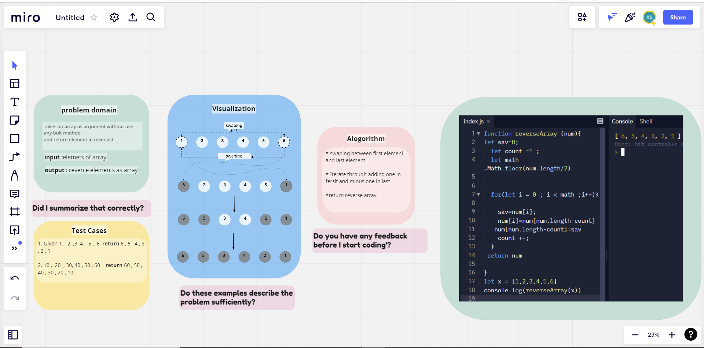

# Reverse an Array
Takes an array as an argument and returns an array elements in reverse 
## Whiteboard Process

## Approach & Efficiency
<!-- What approach did you take? Discuss Why. What is the Big O space/time for this approach? -->