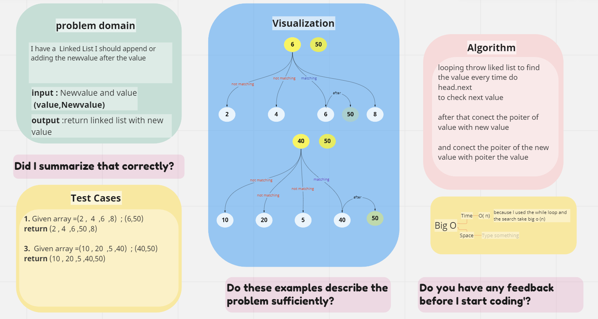
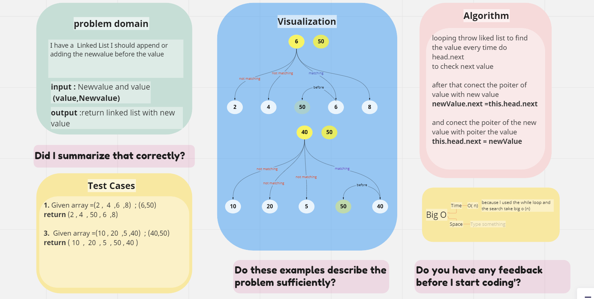

# Challenge Summary
add value in the end of LL and first of LL and after and before the values

## Whiteboard Process

### insertAfter

---
### insertBefore

## Approach & Efficiency
<!-- What approach did you take? Why? What is the Big O space/time for this approach? -->

## Solution
<!-- Show how to run your code, and examples of it in action -->